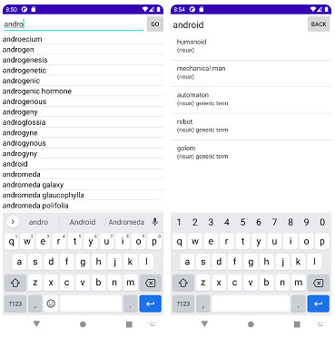

# sdm_thesaurus_android

A project demonstrating how to use [SQL DAL Maker](https://github.com/panedrone/sqldalmaker) + Java/Android/SQLite3.



sdm.xml

```xml

<sdm>

    <dto-class name="Word" ref="WORDS" />

    <dto-class name="RelatedWord" ref="thesaurus/getRelatedWords.sql"/>

    <dao-class name="ThesaurusDao">
        <query-dto-list dto="Word" method="getWordsByKey(key)" ref="getWordsByKey.sql"/>
        <query-dto-list dto="RelatedWord" method="getRelatedWords(Long w_id)"/>
    </dao-class>

</sdm>
```
